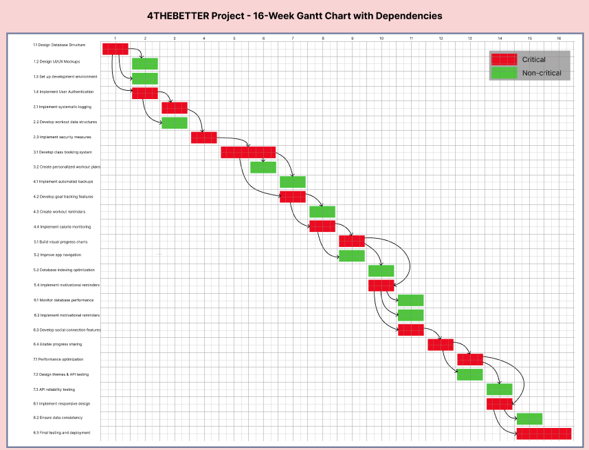
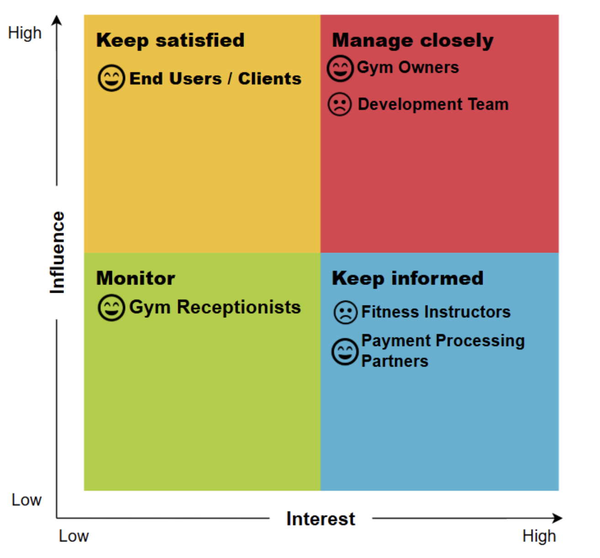
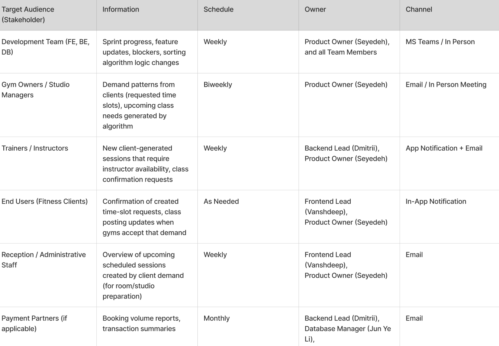
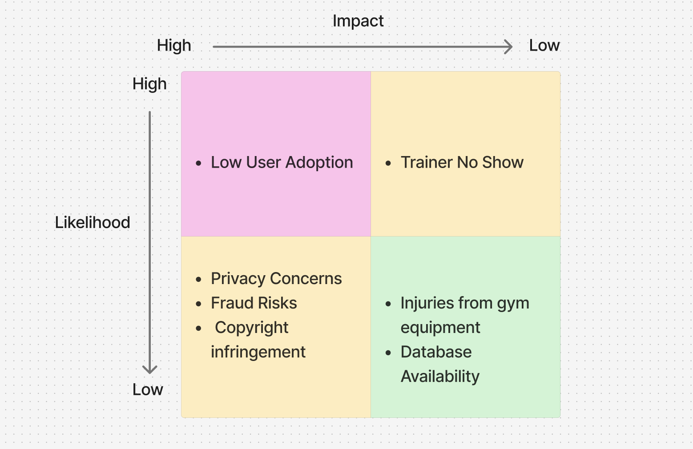

# Project Charter – Workout App

## 1. Introduction 

Our Workout App aims to provide users with a convenient and motivating way to book, track, and monitor their fitness routines. The app will solve many challenges and struggles that users have to find the perfect workout class. 

October 10th, 2025 

## 2. Overview  

This Workout App is a web application that helps users maintain a healthy lifestyle through customized workout planning and progress tracking. 

### 2.1 Objectives

- Promotes consistent physical activities by offering a variety of workout classes 
- Enable users to track progress visually.
- Provide reminders and goal-setting tools to maintain motivation.
- Create a motivational and user-friendly interface.
- Allow integration with wearable fitness devices in future versions.

Implementation of systematic logging, development of efficient data structures for workout tracking and security measures in the backend and database.

## 3. Milestones
1. Design and initial implementation of the core systems: database structure, user authentication process, simple user interface for account aceess and profile management.
2. Implementation of systematic logging, development of efficient data structures for workout tracking and security measures in the backend and database.
3. Goal-driven workout selection, development of personalized plans to train more effectively.
4. Work on automated database backups for data recovery and development of user features for goal tracking, workout reminders, and calorie monitoring.
5. User progress tracking with visual charts, improvement of app navigation, indexing of the database, notifications about future workouts.
6. Monitoring of database performance, implemention of motivational goal reminders, social features for connecting with training partners, progress tracking through visual charts.
7. Optimization of app performance, reliability and design: color themes and fonts, progress sharing with friends, and maintaining reliable API connections.
8. Enabling global app access, ensuring data consistency across all operations, implementing responsive design for mobile and desktop.

### 3.1 Work Breakdown Structure

### 3.2 Requirements Traceability Matrix

| Requirement ID | Requirement Description           | Deliverable ID | Deliverable Description              | Owner  | Status       |
|----------------|-----------------------------------|----------------|--------------------------------------|---------|---------------|
| REQ-001        | User authentication               | DEV-001        | Secure login and session management  | Dev1    | Done          |
| REQ-002        | User registration                 | DEV-002        | Registration form with input validation | Dev2 | In Progress   |
| REQ-003        | User profile                      | DEV-003        | Profile page with editable information | Dev1 | Done          |
| REQ-004        | Class booking & scheduling         | DEV-004        | Real-time studio booking system      | Dev4    | In Progress   |
| REQ-005        | Workout tracking and goal setting  | DEV-005        | Tracker for workouts, calories & goals | Dev3 | In Progress   |
| REQ-006        | Database integration               | DEV-006        | Connected database for all app data  | Dev2    | In Progress   |
| REQ-007        | Error handling & notifications     | DEV-007        | Error handling and user notifications | Dev4 | Not Started   |

## 4. Deliverables

1. Website up and running from the server.
2. Real-time up-to-date scheduling available. 
3. Online/pre-recorded classes offered. 
4. Calory tracker - entered by users.
5. Workout Tracker and suggestions based on previous workouts.

### 4.1 Gantt Chart

## 5. Preliminary Budget

### 5.1 Personnel Cost Per Sprint

| Role                | Rate  | Allocation | Daily Burn Rate | Days (Sprint) | Sprint Burn Rate  |
|---------------------|-------|------------|-----------------|---------------|-------------------|
| Product Owner       | $600  | 50%        | $300            | 10            | $3,000            |
| Front-End Developer | $400  | 100%       | $400            | 10            | $4,000            |
| Back-end Developer  | $400  | 100%       | $400            | 10            | $4,000            |
| Databasse Manager   | $350  | 100%       | $350            | 10            | $3,500            |
| Total               |       |            |                 |               | $14,500           |

### 5.2 Total Personnel Cost
| Sprint Cost | Sprints | Total Personnel Cost  |  
|-------------|---------|-----------------------|
| $14,500     | 8       | $116,000              |

### 5.3 Contigency
| Category          | Base Amount | Rate | Cost     |
|-------------------|-------------|------|----------|
| Sprint Cost       | $116,000    | 10%  | $11,600  |
| Fixed Cost        | $38,280     | 15%  | $5,742   |
| Total Contingency |             |      | $17,342  |

### 5.4 Total Estimated Cost
| Category           | Amount     |
|--------------------|------------|
| Personnel Costs    | $116,000   |
| Fixed Cost         | $38,280    |
| Cotingency Revenue | $17,342    |
| TOTAL BUDGET       | $171,622   |

## 6. Organization and Stakeholders

### 6.1 Stakeholder Analysis Matrix

### 6.2 Communication PLan

## 7. Risks, Assumptions, and Constraints
- **Low User Adoption:** Users might not interact with the app as frequently as expected.
- **Trainer No-Show:** Trainers or instructors may fail to attend sessions they are assigned to.
- **Privacy Concerns:** User information, such as profile details, workout preferences, or booking data, might be exposed or accessed without authorization.
- **Fraud Risks:** The platform might be misused for fraudulent activities, including fake gym partners, suspicious financial behavior, or malicious user sign-ups.
- **Copyright Infringement:** The app’s features or design might unintentionally resemble another platform, resulting in copyright or intellectual property claims.
- **Injuries From Gym Equipment:** Users may experience injuries while following workouts or attending classes.
- **Database Availability:** The database might become unavailable during high-traffic booking periods, preventing users from accessing schedules.

### Risk Evaluation Chart 
